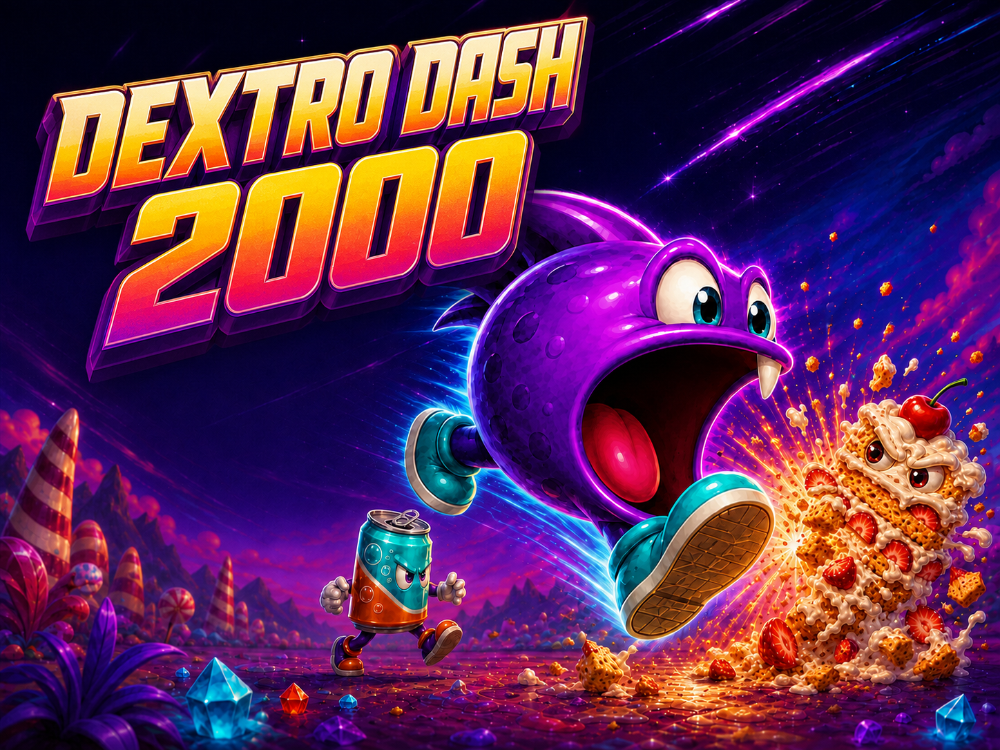
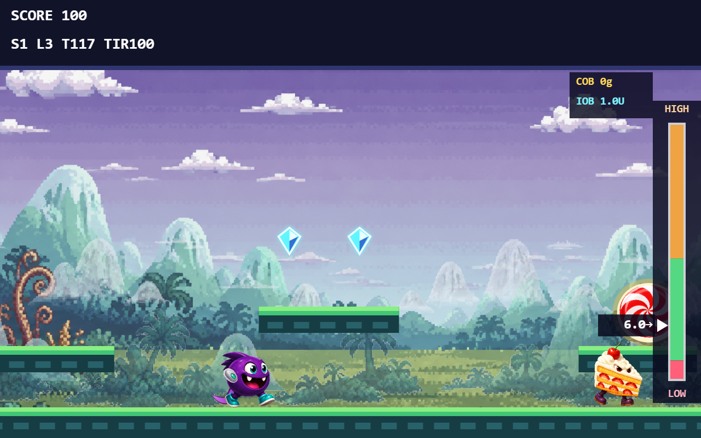
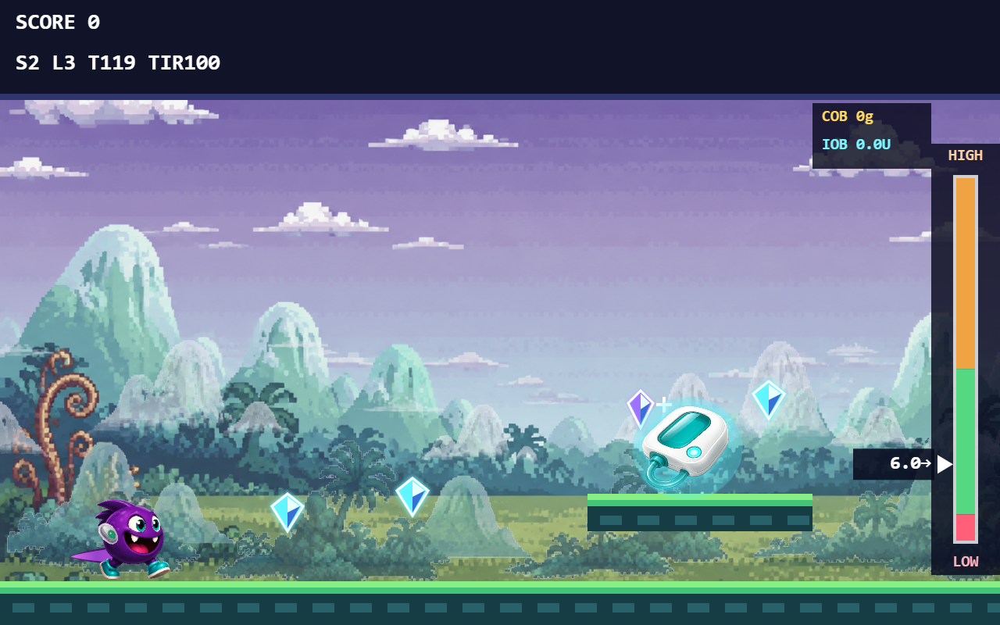

<p align="center">
  
</p>

<h1 align="center">DEXTRO DASH 2000</h1>

<p align="center">
  A type 1 diabetes arcade platformer where reaching the finish is only half the challenge: you must also control DEX's blood glucose.
</p>

<p align="center">
  <a href="https://krauhe.github.io/dextro-dash-2000/"><strong>PLAY IN YOUR BROWSER</strong></a>
  &nbsp; | &nbsp;
  <a href="https://github.com/krauhe/t1d-simulator">T1D Simulator</a>
  &nbsp; | &nbsp;
  <a href="LICENSE">GPL-3.0</a>
</p>

> **Prototype status:** This experimental arcade game uses a fixed fictional DEX and no personal health data. It is not intended for medical use or treatment decisions and never provides dosing recommendations. Regulatory status has not been formally determined.

See [the EU/FDA regulatory design boundaries](docs/REGULATORY-DESIGN-GUIDELINES.md) for the project's no-dosing rule, feature restrictions and release checklist.

## The game

DEXTRO DASH 2000 is a standalone type 1 diabetes browser game inspired by the energy, colour and immediacy of early-1990s home-computer platform games. Completing each platform stage is only one part of the challenge: the player must also control DEX's blood glucose throughout the level. A real-time physiology engine tracks true blood glucose, carbohydrate on board and insulin on board while DEX runs, jumps and eats food monsters.

Food is part of the level design. Running into a food monster means eating it, with its carbohydrate, protein and fat entering the simulation. Stomping it removes the threat and creates a super-jump. Insulin can lower DEX's blood glucose and candy can raise it. Low BG costs a life; high BG progressively reduces running speed and jump height. Level bonuses reward remaining time and collected diamonds — there is no TIR bonus.

The local campaign now contains ten stages, an animated title screen, credits and an automatic attract-mode demo. Its 1920 × 1080 Full HD canvas uses a 16:9 view and scales to the browser window without changing jump physics. The first stage introduces Apple Lady; the second adds a wobbling, falling and rolling Egg Man. Later stages introduce banana, avocado, soda, cake, burger and Pizza Lady, with cellar, crystal cave, mountain, ice and volcanic scenery.

## Gameplay

<p align="center">
  
  
</p>

## Play

**[Launch DEXTRO DASH 2000](https://krauhe.github.io/dextro-dash-2000/)**

The game runs directly in a modern desktop browser. No installation, account or build step is required.

## Controls

| Key | Action |
| --- | --- |
| Left / Right | Run and backtrack as far as the beginning of the stage |
| Up | Tap for a small jump; hold for a full jump |
| A | Use one collected 10 g fast-acting candy |
| Z | Use one stored insulin dose when the manual pump is equipped |
| M | Toggle music |
| L | Toggle sound effects |

Without a pump, touching an insulin pen immediately gives DEX one game dose. Both pumps store the first three pens collected. **When the pump is full, extra pens are used immediately**, even if DEX's BG is already low. The manual pump uses a stored dose on Z; the advanced backpack uses stored doses automatically. Neither equipment type guarantees a safe outcome. The backpack's three blue tubes and the HUD counter show its stock.

Round candy is stored on collection and eaten on A; candy canes are eaten on contact. First-use hints appear in a large panel inside the playfield for 12 real seconds, leaving the BG scale visible. There is no opening movement tutorial or generic explanation of food effects: players discover these through play. Remaining tips explain equipment controls and special mechanics, never a recommended treatment action. The whole game, including physiology and the timer, slows to 6% speed while a tip is visible. Press Enter or CONTINUE to dismiss it sooner. TUTORIAL ON/OFF is saved on the device. Low and high BG have different sound warnings, independently of music, and the BG scale pulses outside its green zone. Running speed and jump height decrease continuously and linearly between BG 10 and 19; above 19 the maximum slowdown remains.

Low tunnels include unavoidable food contacts. Other routes place diamonds beside insulin, or require a monster bounce to reach a cache. Hit caches from below to release their contents. Cracked floors give a brief warning before collapsing; later volcanic routes also have lava gaps. See [the campaign design and food provenance](docs/CAMPAIGN.md) for development details and current testing limits.

## Physiology-powered gameplay

The game uses local, browser-native copies of two model files:

1. `engine/hovorka.js` - the Hovorka glucose-insulin model.
2. `engine/physiology-engine.js` - the reusable physiology engine from T1D Simulator.

The prototype runs physiology at four simulated minutes per real second. Its HUD uses true simulated blood glucose without CGM sensor delay or measurement noise. Food monsters have explicit carbohydrate, protein and fat profiles, and rapid insulin is processed by the same model used by T1D Simulator.

Prototype defaults are a fictional 70 kg profile, an insulin sensitivity factor of 3 mmol/L per unit, an insulin-to-carbohydrate ratio of 10 g per unit and a starting blood glucose near 6 mmol/L in steady state.

## Upstream engine synchronization

The physiology files originate in the public [T1D Simulator repository](https://github.com/krauhe/t1d-simulator). A scheduled GitHub Action checks the upstream `main` branch every Monday and can also be run manually.

When either source file changes, the action:

1. Copies `js/hovorka.js` and `js/physiology-engine.js` from T1D Simulator.
2. Runs JavaScript syntax checks and a standalone engine smoke test.
3. Opens or updates a pull request in this repository.

The pull request is deliberately not merged automatically. This keeps the synchronization automatic while ensuring that an upstream API change cannot silently break the playable game.

See [`engine/UPSTREAM.md`](engine/UPSTREAM.md) and [the sync workflow](.github/workflows/sync-physiology-engine.yml) for the exact mapping.

## Run locally

Clone the repository and open `index.html` directly, or serve the folder with any static HTTP server:

```bash
git clone https://github.com/krauhe/dextro-dash-2000.git
cd dextro-dash-2000
python -m http.server 8000
```

Then open `http://localhost:8000/`.

There is no framework, package installation or compilation step. The project is plain HTML, CSS and JavaScript using the Canvas and Web Audio APIs.

## Level development and checks

Open the [DEX Workshop](docs/dex-workshop.html) to prototype modular character animation: pause or step frames, switch direction, toggle body parts and equipment, inspect attachment points, adjust offsets and export visual rig settings. It reuses current DEX artwork with code-drawn arm and tail sketches. The face is still part of the body images; this separate art tool does not change gameplay or run physiology.

Open the separate [DEX 3D Character Lab](docs/dex-3d.html) for the first articulated 3D concept: rotate the model, scrub idle/run/jump/eat animations, change skins and surface finishes, and preview removable equipment. Local texture files stay on the device. This is a procedural art prototype, not a finished sculpt, a production skinned rig or a change to the live game. Its local Three.js dependency retains the [MIT licence](docs/vendor/THREE-LICENSE).

Open [the level workshop](docs/level-overview.html) for zoomable maps of all ten actual stages, food patrols, solid ceilings, caches, crumbling floors and diamond-risk clusters. It runs locally, including directly from a file. Height is exaggerated in the overview for readability; the game currently scrolls horizontally only.

Generate a reproducible, **unpublished draft** and load its JSON through the workshop's file input:

```bash
node tools/generate-level.cjs --stage 3 --seed 42 --out stage-3-draft.json
node tests/engine-smoke.test.js
node tests/gameplay.test.js
node tests/level-tools.test.cjs
```

The helper uses the same campaign factory as the game: apple first, egg second, followed by the more varied cast. Its seed varies optional bonus placements while preserving essential jump geometry and pen/diamond overlaps. It refuses to overwrite an existing draft. Every candidate still needs route review and an in-game playtest before integration. Developer shortcuts 1–9 select those stages; 0 selects stage 10.

The local Codex skill `dextro-level-generator` guides this workflow. New food profiles require ordinary serving-size and macronutrient data; they must not be modelled as interchangeable sugar pickups. The regression suite checks gameplay behavior, not clinical validity or suitability for treatment decisions.

## Credits

**Concept and direction:** Kristian Rauhe Harreby<br>
**Development and creative collaboration:** OpenAI Codex<br>
**Original game art, code and music:** DEXTRO DASH 2000 project<br>
**Physiology engine:** [T1D Simulator](https://github.com/krauhe/t1d-simulator)<br>
**Core glucose-insulin model:** Hovorka model implementation distributed with T1D Simulator

DEXTRO DASH 2000 reuses the open-source physiology work developed for T1D Simulator. Both projects are released under the GNU General Public License version 3.

## License

DEXTRO DASH 2000 is free and open-source software licensed under the [GNU General Public License v3.0](LICENSE).
