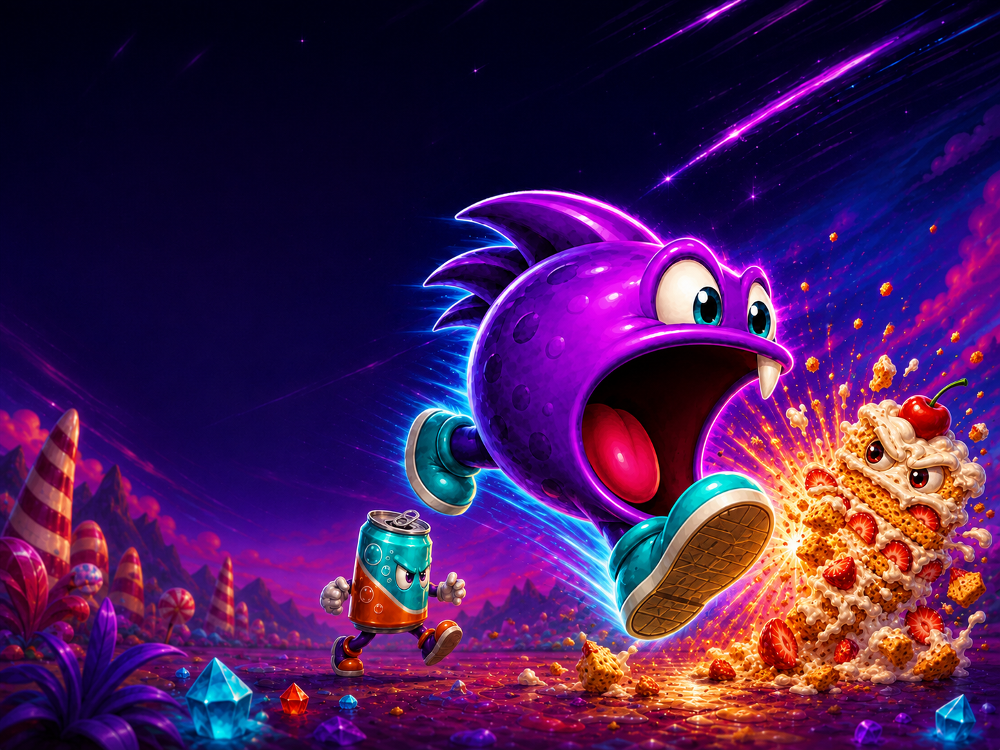

<p align="center">
  
</p>

<h1 align="center">DEXTRO DASH 2000</h1>

<p align="center">
  A physiology-powered arcade platformer starring DEX.
</p>

<p align="center">
  <a href="https://krauhe.github.io/dextro-dash-2000/"><strong>PLAY IN YOUR BROWSER</strong></a>
  &nbsp; | &nbsp;
  <a href="https://github.com/krauhe/t1d-simulator">T1D Simulator</a>
  &nbsp; | &nbsp;
  <a href="LICENSE">GPL-3.0</a>
</p>

> **Prototype status:** This is an experimental game, not a medical device or a source of treatment advice. It uses fixed fictional parameters and does not use personal health data.

## The game

DEXTRO DASH 2000 is a standalone browser arcade prototype inspired by the energy, colour and immediacy of early-1990s home-computer platform games. DEX runs, jumps and eats food monsters while a real-time physiology engine tracks true blood glucose, carbohydrate on board and insulin on board.

Food is part of the level design. Running into a food monster means eating it, with its carbohydrate, protein and fat entering the simulation. Stomping it removes the threat and creates a super-jump. Insulin can lower blood glucose, candy can raise it, and staying in range improves the level bonus.

The game currently contains two playable stages, an animated title screen, credits and an automatic attract-mode demo.

## Gameplay

<p align="center">
  
  
</p>

## Play

**[Launch DEXTRO DASH 2000](https://krauhe.github.io/dextro-dash-2000/)**

The game runs directly in a modern desktop browser. No installation, account or build step is required.

## Controls

| Key | Action |
| --- | --- |
| Left / Right | Run and backtrack as far as the beginning of the stage |
| Up | Jump |
| A | Use one collected 10 g fast-acting candy |
| Z | Use one stored insulin dose when the manual pump is equipped |
| M | Toggle music |
| L | Toggle sound effects |

In stage 1, touching an insulin pen immediately delivers 1 unit of rapid-acting insulin. In stage 2, the manual pump can store up to three pens. The advanced pump automatically delivers stored insulin when true blood glucose is above 7 mmol/L.

## Physiology-powered gameplay

The game uses local, browser-native copies of two model files:

1. `engine/hovorka.js` - the Hovorka glucose-insulin model.
2. `engine/physiology-engine.js` - the reusable physiology engine from T1D Simulator.

The prototype runs physiology at four simulated minutes per real second. Its HUD uses true simulated blood glucose without CGM sensor delay or measurement noise. Food monsters have explicit carbohydrate, protein and fat profiles, and rapid insulin is processed by the same model used by T1D Simulator.

Prototype defaults are a fictional 70 kg profile, an insulin sensitivity factor of 3 mmol/L per unit, an insulin-to-carbohydrate ratio of 10 g per unit and a starting blood glucose near 6 mmol/L in steady state.

## Upstream engine synchronization

The physiology files originate in the public [T1D Simulator repository](https://github.com/krauhe/t1d-simulator). A scheduled GitHub Action checks the upstream `main` branch every Monday and can also be run manually.

When either source file changes, the action:

1. Copies `js/hovorka.js` and `js/physiology-engine.js` from T1D Simulator.
2. Runs JavaScript syntax checks and a standalone engine smoke test.
3. Opens or updates a pull request in this repository.

The pull request is deliberately not merged automatically. This keeps the synchronization automatic while ensuring that an upstream API change cannot silently break the playable game.

See [`engine/UPSTREAM.md`](engine/UPSTREAM.md) and [the sync workflow](.github/workflows/sync-physiology-engine.yml) for the exact mapping.

## Run locally

Clone the repository and open `index.html` directly, or serve the folder with any static HTTP server:

```bash
git clone https://github.com/krauhe/dextro-dash-2000.git
cd dextro-dash-2000
python -m http.server 8000
```

Then open `http://localhost:8000/`.

There is no framework, package installation or compilation step. The project is plain HTML, CSS and JavaScript using the Canvas and Web Audio APIs.

## Credits

**Concept and direction:** Kristian Rauhe Harreby<br>
**Development and creative collaboration:** OpenAI Codex<br>
**Original game art, code and music:** DEXTRO DASH 2000 project<br>
**Physiology engine:** [T1D Simulator](https://github.com/krauhe/t1d-simulator)<br>
**Core glucose-insulin model:** Hovorka model implementation distributed with T1D Simulator

DEXTRO DASH 2000 reuses the open-source physiology work developed for T1D Simulator. Both projects are released under the GNU General Public License version 3.

## License

DEXTRO DASH 2000 is free and open-source software licensed under the [GNU General Public License v3.0](LICENSE).
